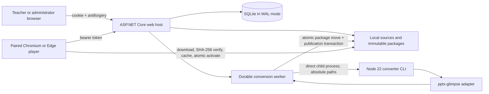

# Architecture

The application is intentionally a single-host system. One ASP.NET Core process owns one data root; an exclusive lock prevents a second instance from opening it. SQLite stores metadata and durable jobs. Uploaded source files and content-addressed packages live on the same host filesystem. Rendering never runs inside a database transaction.

Conversion jobs are leased from SQLite. Stale processing leases become claimable after their expiry, so restart recovery does not need an external queue. A presentation is published only after every PNG, supported extracted video, and the manifest have been validated/hashed and the completed package has been atomically moved into `packages/<contentId>`. Video extraction reads internal PPTX relationships without external fetches or executing embed HTML. Recognised YouTube references retain only a validated video ID and timing metadata.

Players poll an assignment endpoint with ETags, download the complete manifest and assets into Cache Storage, verify SHA-256 hashes with Web Crypto, then change the active package pointer in IndexedDB. The active and previous packages are retained. A service worker serves the player shell and cached package after network loss or browser restart.

Production TLS terminates at a normal reverse proxy. Human identity uses OIDC or on-premises AD LDAPS and a secure local cookie; display identity uses a random bearer token. Staff roles and screen-group grants are owned by SQLite, with role refresh on each authenticated request and grant checks before upload and queued publication. AD credentials are used only for a TLS-protected bind/identity lookup and are never persisted. The Node converter is never exposed as an HTTP service.

Video packages use schema 2; image-only schema 1 packages remain supported. Local media overlays the rendered background and advances on completion. YouTube uses the official online iframe API, narrowly scoped player CSP permissions and origin-only referrers; it is never downloaded/cached and is skipped offline. Byte-range cache responses support local video seeking. Hashed shell asset filenames and a build-specific shell cache prevent stale player JavaScript after updates.
